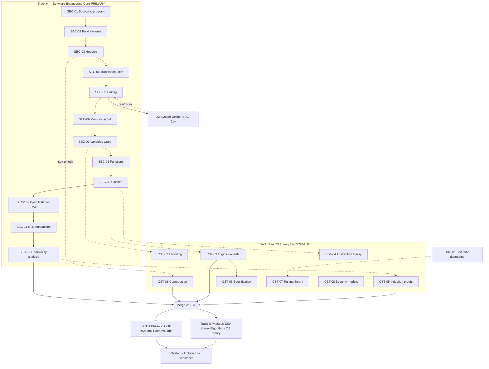
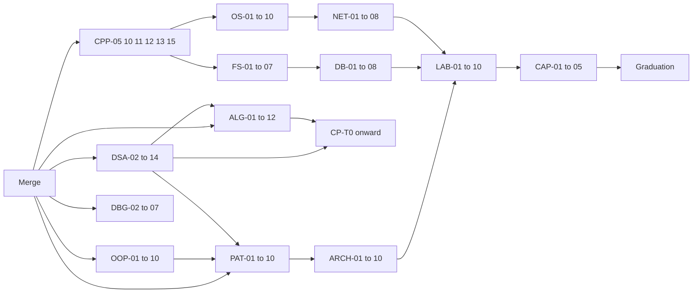
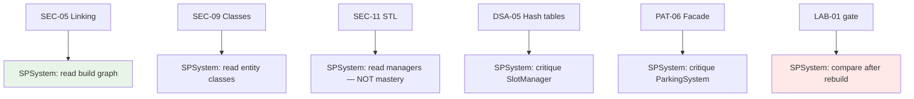

# Curriculum Dependency Graph (v2.0)

> **Rule:** Track A (Software Engineering Core) is the **primary critical path**. Track B enriches in parallel; hard gates apply at merge points.

## Legend

| Edge | Meaning |
|------|---------|
| `A → B` | **Hard prerequisite** — must be MASTERED |
| `A ⇢ B` | **Soft prerequisite** — recommended parallel |
| `A ⟷ B` | **Merge requirement** — both required before continuation |

---

## Rationale for Revised Ordering

### Problem with v1.0

Version 1.0 began with **F-01 "What is computation?"** — correct for a traditional CS degree, wrong for your stated objective and current context:

| v1.0 issue | Your reality |
|------------|--------------|
| Abstract before concrete | You already maintain a multi-file C++ project |
| Theory before toolchain | Build/link errors are immediate daily blockers |
| "Computation" before `main()` | You need to know why `ParkingSystem.cpp` links before Turing machines |
| SPSystem deferred too late | Codebase is a **construction laboratory**, not proof of mastery |

### v2.0 principle: **Construct → Observe → Theorize**

1. **Build first** — compile, link, run (SEC-01–05)
2. **Memory second** — layout before abstraction (SEC-06–07)
3. **Code organization third** — functions, classes, lifetimes (SEC-08–10)
4. **Libraries fourth** — STL as engineered components (SEC-11)
5. **Analysis fifth** — complexity with real structures in hand (SEC-12)
6. **Theory parallel** — computation, logic, proof **after** you've touched real TUs (CST-01+)

This matches professional onboarding: junior engineers learn build + debugger + codebase before automata theory.

### Why build systems (SEC-02) come early

Manual `g++` with 8 files (your README) does not scale. CMake is not "advanced" — it is **the professional expression of SEC-01–05**. Learning it immediately prevents conflating "compilation" with "one long shell command."

### Why memory layout (SEC-06) precedes full types (SEC-07)

You cannot understand `std::unordered_map<string, ParkingSlot>` until you know:
- Where `ParkingSystem` lives (stack as subobject)
- Where container nodes live (heap)
- What "object" means in memory

Types are the **language view**; layout is the **machine view**. Engineering mastery requires machine view first.

### Why SEC-10 (lifetimes) follows SEC-09 (classes)

Classes introduce destruction order, subobjects, and RAII. Lifetime is not a separate topic — it is the **temporal dimension** of the object model.

### Why complexity (SEC-12) is last in Phase A1

Big-O without structures is algebra. After STL and SPSystem's `unordered_map` vs linear scan, complexity is **engineering judgment**, not notation drill.

### Track B does not block Track A

CST-01 unlocks after SEC-03 (you've seen headers). Theory never prevents you from compiling tomorrow's lab work.

### Merge point

Tracks reunite when you can **both** rebuild a project **and** write invariants for it — construction skill + reasoning skill.

---

## Dual-Track Phase Graph

---

## SEC Topic Hard Dependencies (Track A Phase 1)

| Topic | Hard Prerequisites |
|-------|-------------------|
| SEC-01 | None — **entry point** |
| SEC-02 | SEC-01 |
| SEC-03 | SEC-02 |
| SEC-04 | SEC-03 |
| SEC-05 | SEC-04 |
| SEC-06 | SEC-05 |
| SEC-07 | SEC-06 |
| SEC-08 | SEC-07 |
| SEC-09 | SEC-08 |
| SEC-10 | SEC-09 |
| SEC-11 | SEC-10 |
| SEC-12 | SEC-11 |

**Linear by design** — each step answers a question raised by the previous when reading SPSystem.

---

## CST Topic Dependencies (Track B Phase 1)

| Topic | Hard Prerequisites | Soft Parallel |
|-------|-------------------|---------------|
| CST-01 | SEC-03 | — |
| CST-02 | SEC-07 | SEC-06 |
| CST-03 | SEC-09 | — |
| CST-04 | CST-03 | SEC-09 |
| CST-05 | SEC-12 | — |
| CST-06 | CST-03 | — |
| CST-07 | DBG-01 | SEC-08 |
| CST-08 | FS-02 | — |

---

## Merge Gate Requirements

Before **Track A Phase 2** and full **LAB-01** eligibility:

| Requirement | Track |
|-------------|-------|
| SEC-01–SEC-12 all MASTERED | A |
| CST-01, CST-03, CST-05 MASTERED | B |
| FE-A1 Construction exam ≥80% | A |
| FE-B1 Specification exam ≥75% | B |
| RFS-A1: 3-file project rebuild in 3 hours | A |

---

## Post-Merge Critical Path

---

## SPSystem Dependency (case study only)

**Rule:** Green nodes = observation after prerequisite. Red = comparison only after independent rebuild. **Never** an edge into mastery without gate.

---

## Laboratory Dependencies (unchanged logic, new entry)

| Lab | Hard Prerequisites |
|-----|-------------------|
| LAB-01 | **Merge gate** + OOP-04 + DSA-05 + PAT-06 + FS-02 + DBG-02 |
| LAB-02 | LAB-01 + DSA-14 + FS-03 |
| LAB-03+ | See `14_Project_Laboratories/LABORATORY_ROADMAP.md` |

LAB-01 no longer reachable before SEC-01–12 — SPSystem familiarity does not shorten path.

---

## Competitive Programming Entry (revised)

| Old | New |
|-----|-----|
| CP after DSA-01 at program start | CP-T0 unlocks after **SEC-12** (you can analyze before optimizing) |
| CP parallel from year 1 | CP-T0 weeks 14–16; 3 hrs/week |

---

## Anti-Patterns (v2.0)

| Violation | Consequence |
|-----------|-------------|
| Starting CST-01 before SEC-03 | Theory detached from code you write daily |
| Skipping SEC-02 build systems | Manual compile becomes "how C++ works" |
| SEC-12 before SEC-11 | Complexity without real containers |
| Reading SPSystem during SEC-01–08 | Premature pattern absorption |
| Treating Track B as optional forever | Cannot pass FE-B1 or graduation oral |

---

## Section Index (dependency tier)

| Tier | Sections | When |
|------|----------|------|
| T0 Entry | SEC-01 | Day 1 |
| T1 Construction | 02 (SEC), 10 (DBG-01) | Months 1–4 |
| T2 Merge | 01 (CST), 03 (DSA-01), 04 | Months 4–6 |
| T3 Design | 05, 06, 11 | Months 6–12 |
| T4 Systems | 07, 12, 13 | Months 12–24 |
| T5 Synthesis | 14–20, 09 | Months 18+ |

---

*Dependency graph version: 2.0 — construction-first, dual-track*
