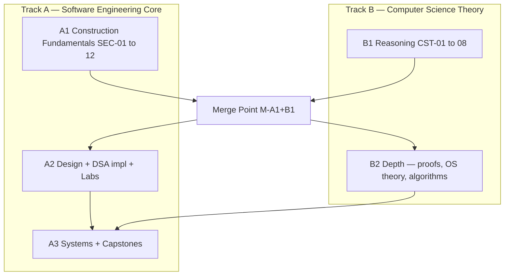

# Learning Tracks

> **Objective:** Practical software engineering mastery **combined with** deep computer science understanding — not a traditional CS degree sequence.

---

## Track Overview

| Track | Role | Pace | Entry |
|-------|------|------|-------|
| **Track A — Software Engineering Core** | Primary path — how to build real systems | Lead schedule | Immediate (no prerequisites) |
| **Track B — Computer Science Theory** | Enrichment — why things work, proofs, models | Parallel, 25–35% of weekly hours | Soft-parallel from Week 4; hard unlock at merge points |

**Merge point:** After Track A Phase 1 (Software Construction Fundamentals) + Track B Phase 1 (Reasoning Foundations) → unified progression through OOP, DSA structures, architecture, systems.

---

## Track A — Software Engineering Core

**Philosophy:** You are already working with a multi-file C++ codebase. Understand **why it compiles, links, loads, executes, stores memory, and organizes code** before abstract theory.

### Phase A1 — Software Construction Fundamentals (Weeks 1–16)

| Order | ID | Topic | Section | SPSystem lens |
|-------|-----|-------|---------|---------------|
| 1 | SEC-01 | Source code → running program | 02 | `g++` command in README |
| 2 | SEC-02 | Build systems (CMake, targets) | 02 | Replace manual compile |
| 3 | SEC-03 | Headers & source file discipline | 02 | `.h`/`.cpp` split |
| 4 | SEC-04 | Translation units | 02 | One `.cpp` = one TU |
| 5 | SEC-05 | Linking & symbol resolution | 02 | 8-file link line |
| 6 | SEC-06 | Memory layout (stack, heap, segments) | 02 | Manager objects in `ParkingSystem` |
| 7 | SEC-07 | Variables, types, representations | 02 | `types.h`, `enum class` |
| 8 | SEC-08 | Functions & calling conventions | 02 | Manager method calls |
| 9 | SEC-09 | Classes & object model | 02 | `Vehicle`, `ParkingSlot` |
| 10 | SEC-10 | Object lifetimes & RAII | 02 | Container ownership in managers |
| 11 | SEC-11 | STL foundations (vector, map, unordered_map) | 02 | `SlotManager` containers |
| 12 | SEC-12 | Complexity analysis (practical) | 03 | `data_structures_report.md` |

**Phase A1 exit:** Rebuild a 3-file C++ project from memory; explain SPSystem's build graph; justify one container choice with Big-O.

### Phase A2 — Construction + Design (Weeks 17–40)

| Block | Topics |
|-------|--------|
| C++ completion | CPP-05 pointers, CPP-10 algorithms, CPP-11 I/O, CPP-12 errors, CPP-13 move, CPP-15 sanitizers |
| OOP applied | OOP-01–OOP-06 |
| DSA implemented | DSA-02–DSA-06 (implement, not just use STL) |
| Debugging | DBG-01–DBG-03 |
| Patterns | PAT-01–PAT-06 |
| Persistence | FS-01–FS-03 |
| First lab gate | LAB-01 (after SEC-01–12 + OOP-04 + DSA-05) |

### Phase A3 — Systems Engineering (Weeks 41+)

Architecture, OS, networking, databases, advanced labs, capstones — see `CURRICULUM_ROADMAP.md`.

---

## Track B — Computer Science Theory

**Philosophy:** Deepen understanding without blocking the ability to ship code. Theory **confirms and sharpens** what you already built.

### Phase B1 — Reasoning Foundations (parallel to A1, weeks 4–20)

| Order | ID | Topic | Section | Unlock |
|-------|-----|-------|---------|--------|
| 1 | CST-01 | What is computation? | 01 | After SEC-03 (you've seen real code first) |
| 2 | CST-02 | Information & encoding | 01 | After SEC-07 |
| 3 | CST-03 | Logic, predicates, invariants | 01 | After SEC-09 |
| 4 | CST-04 | Abstraction & decomposition theory | 01 | After SEC-09 |
| 5 | CST-05 | Induction & proof basics | 01 | After SEC-12 |
| 6 | CST-06 | Requirements & formal specification | 01 | After CST-03 |
| 7 | CST-07 | Testing theory & oracles | 01 | Parallel DBG-01 |
| 8 | CST-08 | Security & trust models | 01 | After FS-02 |

**Phase B1 exit:** FE-B1 — specification + invariant document for any management domain.

### Phase B2 — Theory Depth (merged schedule)

| Block | Topics |
|-------|--------|
| DSA theory | DSA-07–DSA-14, amortized proofs |
| Algorithms | ALG-01–ALG-12 |
| OS theory | OS-01–OS-10 |
| Research | RES-01–RES-04 |

---

## Merge Map

**Merge requirements (both):**
- SEC-01 through SEC-12 mastered
- CST-01, CST-03, CST-05 mastered
- FE-A1 (construction exam) passed
- FE-B1 (specification exam) passed

After merge, single critical path with theory enrichment modules alongside each engineering topic.

---

## Weekly Time Split (recommended)

| Track | Hours/week (of 17.5) |
|-------|----------------------|
| Track A (primary) | 12–14 |
| Track B (theory) | 3–5 |
| CP (parallel from SEC-12) | 2–3 |

---

## Per-Topic Deliverable Layers (both tracks)

Every topic includes **all applicable** layers:

| Layer | Content |
|-------|---------|
| **Theory** | Why it exists, models, history |
| **Practice** | Exercises, coding drills |
| **Laboratory** | Domain lab tie-in (when applicable) |
| **Rebuild-from-memory** | RFS micro-challenge |
| **Examination prep** | Section exam style questions |
| **Interview prep** | Oral + whiteboard prompts |
| **CP relevance** | Problems (if applicable) |
| **OSS relevance** | Codebase reading pointers (if applicable) |

Plus the 27 standard artifacts from `UNIVERSITY_CHARTER.md`.

---

## ID Cross-Reference

| SEC ID | Maps to |
|--------|---------|
| SEC-01 | CPP-01 |
| SEC-02 | CPP-14 (early placement) |
| SEC-03–05 | CPP-02 (split for pedagogy) |
| SEC-06 | CPP-04 (memory layout first) |
| SEC-07 | CPP-03 |
| SEC-08 | CPP-06 |
| SEC-09 | CPP-07 (intro) |
| SEC-10 | CPP-04 (lifetimes/RAII depth) |
| SEC-11 | CPP-09 |
| SEC-12 | DSA-01 |

| CST ID | Maps to |
|--------|---------|
| CST-01 | F-01 |
| CST-02 | F-02 |
| CST-03 | F-03 + F-04 partial |
| CST-04 | F-04 |
| CST-05 | F-03 proof depth |
| CST-06 | F-07 |
| CST-07 | F-08 |
| CST-08 | F-10 |

---

## Section 22 — System Design Challenges

Parallel design track. Unlocks **SDC-01 after SEC-05**. Does not replace SEC. See `22_System_Design_Challenges/ROADMAP.md`.

---

*Learning tracks version: 2.1 — frozen + SDC*
