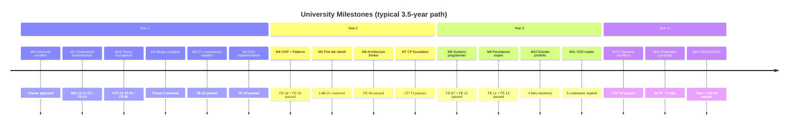

# Milestones

> Milestones are **evidence-based checkpoints**. Completing a project ≠ achieving a milestone.

## Milestone Map

---

## M0 — University Enrolled

| Field | Value |
|-------|-------|
| **Trigger** | Charter + foundational docs approved |
| **Evidence** | This repository initialized |
| **Unlocks** | Topic F-01 |
| **Status** | `COMPLETE` |

---

## M1 — Construction Fundamentals (Track A)

| Field | Value |
|-------|-------|
| **Trigger** | SEC-01–SEC-12 mastered + FE-A1 passed |
| **Evidence** | CMake project; SPSystem build graph from memory |
| **Skills proven** | Compile/link/load, memory layout, classes, STL, Big-O |
| **Unlocks** | Track A Phase 2, SPSystem observation exercises |
| **Estimated** | Month 3–4 |

---

## M1b — Theory Foundations (Track B)

| Field | Value |
|-------|-------|
| **Trigger** | CST-01, CST-03, CST-05 mastered + FE-B1 passed |
| **Evidence** | Graded specification with invariants |
| **Skills proven** | Computation model, logic, proof, specification |
| **Unlocks** | Full CST track, merge gate completion |
| **Estimated** | Month 4–5 (parallel) |

---

## M2 — Merge Complete

| Field | Value |
|-------|-------|
| **Trigger** | M1 + M1b + RFS-A1 (3-file rebuild in 3h) |
| **Unlocks** | OOP, DSA impl, PAT, LAB-01 path, CP-T0 |
| **Estimated** | Month 5–6 |

---

## M3 — C++ Mechanism Mastery

| Field | Value |
|-------|-------|
| **Trigger** | FE-02 passed |
| **Evidence** | Supervised coding exam artifact |
| **Skills proven** | Pointers, move, full STL, error handling |
| **Unlocks** | OS-01, RFS-T1 |
| **Estimated** | Month 10–14 |

---

## M4 — DSA Implementer

| Field | Value |
|-------|-------|
| **Trigger** | FE-03 passed |
| **Evidence** | Hash table + BST from scratch |
| **Skills proven** | Complexity proof, structure implementation |
| **Unlocks** | ALG full track, LAB-01 eligibility |
| **Estimated** | Month 12–16 |

---

## M5 — OOP & Pattern Practitioner

| Field | Value |
|-------|-------|
| **Trigger** | FE-04 + FE-05 passed |
| **Evidence** | Refactored monolith + oral defense |
| **Unlocks** | ARCH-01, advanced labs planning |
| **Estimated** | Month 16–20 |

---

## M6 — First Laboratory Rebuilt

| Field | Value |
|-------|-------|
| **Trigger** | LAB-01 mastered (not merely SPSystem reviewed) |
| **Evidence** | Timed rebuild + oral change-request |
| **Skills proven** | Domain CRUD, persistence, manager decomposition |
| **Note** | SPSystem analysis contributes; **rebuild is the gate** |
| **Unlocks** | LAB-02, CAP-01 planning |
| **Estimated** | Month 18–22 |

---

## M7 — Architecture Thinker

| Field | Value |
|-------|-------|
| **Trigger** | FE-06 passed |
| **Evidence** | C4 + ADR portfolio |
| **Unlocks** | LAB-04, CAP-01 start |
| **Estimated** | Month 22–26 |

---

## M8 — Competitive Programming Foundation

| Field | Value |
|-------|-------|
| **Trigger** | CP-T3 passed (see CP roadmap) |
| **Evidence** | 80+ logged solves, tier exam |
| **Unlocks** | CP-T4+, interview speed rounds |
| **Estimated** | Month 12–18 (parallel) |

---

## M9 — Systems Programmer

| Field | Value |
|-------|-------|
| **Trigger** | FE-07 + FE-12 passed |
| **Evidence** | mini-shell + TCP/HTTP server |
| **Unlocks** | LAB-08, NET advanced, RFS-T3 |
| **Estimated** | Month 26–32 |

---

## M10 — Persistence & Data Expert

| Field | Value |
|-------|-------|
| **Trigger** | FE-11 + FE-13 passed |
| **Evidence** | Schema design + SQLite integration |
| **Unlocks** | LAB-06, CAP-02 |
| **Estimated** | Month 28–34 |

---

## M11 — Domain Portfolio

| Field | Value |
|-------|-------|
| **Trigger** | 4 laboratories mastered |
| **Required mix** | ≥2 core (01–04) + ≥1 advanced (05–08) |
| **Unlocks** | CAP-04 proposal |
| **Estimated** | Month 30–40 |

---

## M12 — Open Source Reader

| Field | Value |
|-------|-------|
| **Trigger** | 3 OSS studies completed with reports |
| **Evidence** | `15_Open_Source_Studies/reports/` |
| **Unlocks** | OSS advanced (kernel, database internals) |
| **Estimated** | Month 24–36 (parallel) |

---

## M13 — Capstone Architect

| Field | Value |
|-------|-------|
| **Trigger** | CAP-02 passed |
| **Evidence** | Networked service with DB, deployed locally |
| **Unlocks** | CAP-04, graduation track |
| **Estimated** | Month 36–44 |

---

## M14 — Graduation Candidate

| Field | Value |
|-------|-------|
| **Trigger** | All FE-01–FE-13 passed; 6 labs; RFS-T4; 10 mocks |
| **Evidence** | `GRADUATION_REQUIREMENTS.md` checklist complete |
| **Unlocks** | CAP-05 scheduling |
| **Estimated** | Month 40–48 |

---

## M15 — GRADUATED

| Field | Value |
|-------|-------|
| **Trigger** | Graduation oral + CAP-05 passed |
| **Evidence** | Certificate entry in `MASTERY_LOG.md` |
| **Outcome** | Independent professional implementation capability |

---

## Milestone Review Cadence

| Frequency | Activity |
|-----------|----------|
| Weekly | Hours logged; current topic gate status |
| Monthly | Milestone distance report; weakness review |
| Quarterly | Oral progress exam (cumulative) |
| Annually | Curriculum roadmap revision |

---

*Milestones version: 1.0*
