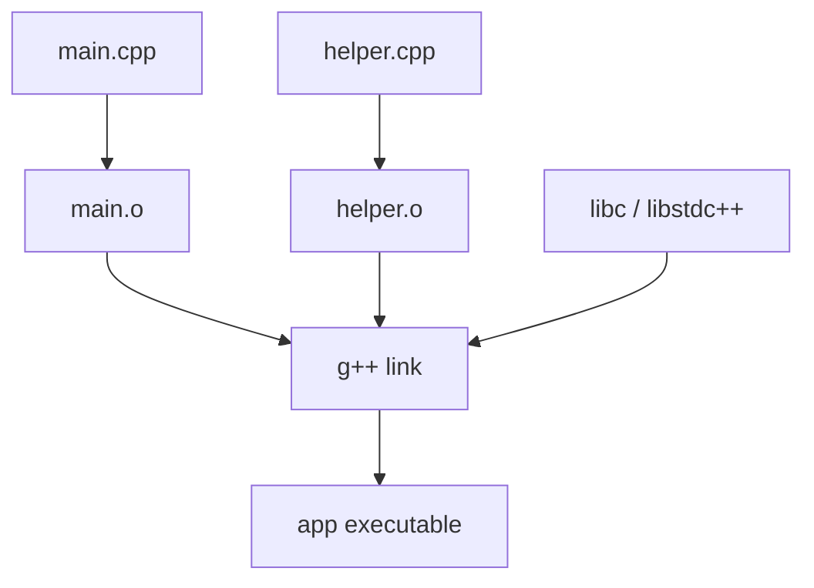
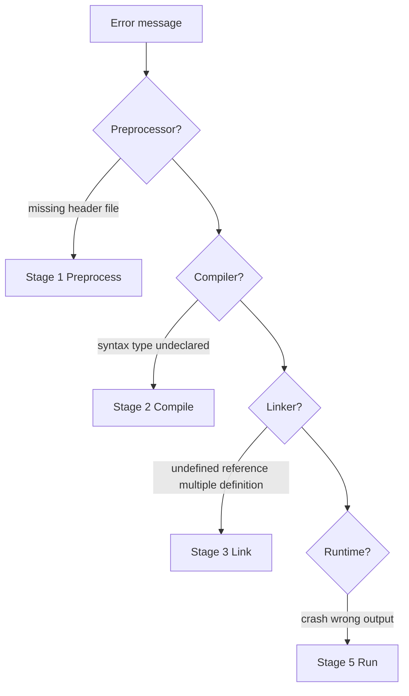
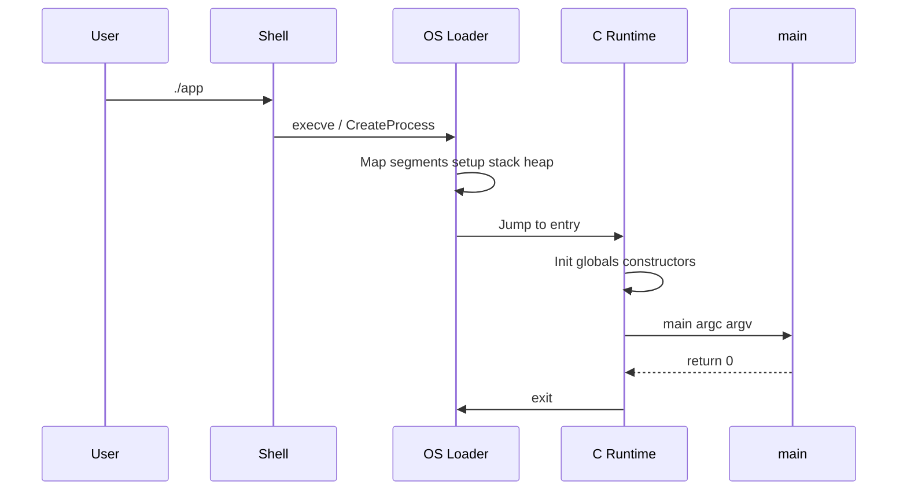
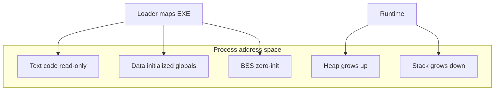

# SEC-01 Diagrams

## Pipeline overview

```mermaid
flowchart LR
    SRC[Source .cpp + headers]
    PP[Preprocessor]
    COMP[Compiler per TU]
    OBJ[Object files .o]
    LINK[Linker]
    EXE[Executable]
    LOAD[OS Loader]
    RUN[main runs]

    SRC --> PP --> COMP --> OBJ --> LINK --> EXE --> LOAD --> RUN
```

## Multi-file project

```mermaid
flowchart TB
    M[main.cpp] --> MO[main.o]
    H[helper.cpp] --> HO[helper.o]
    MO --> LINK[g++ link]
    HO --> LINK
    LIB[libc / libstdc++] --> LINK
    LINK --> APP[app executable]
```

## Error stage classifier

```mermaid
flowchart TD
    E[Error message]
    E --> Q1{Preprocessor?}
    Q1 -->|missing header file| PP[Stage 1 Preprocess]
    Q1 --> Q2{Compiler?}
    Q2 -->|syntax type undeclared| COMP[Stage 2 Compile]
    Q2 --> Q3{Linker?}
    Q3 -->|undefined reference multiple definition| LINK[Stage 3 Link]
    Q3 --> Q4{Runtime?}
    Q4 -->|crash wrong output| RUN[Stage 5 Run]
```

## Process birth (load + run)

```mermaid
sequenceDiagram
    participant User
    participant Shell
    participant OS as OS Loader
    participant CRT as C Runtime
    participant Main as main

    User->>Shell: ./app
    Shell->>OS: execve / CreateProcess
    OS->>OS: Map segments setup stack heap
    OS->>CRT: Jump to entry
    CRT->>CRT: Init globals constructors
    CRT->>Main: main argc argv
    Main-->>CRT: return 0
    CRT->>OS: exit
```

## Memory at run (preview)

```mermaid
flowchart TB
    subgraph Process address space
        TEXT[Text code read-only]
        DATA[Data initialized globals]
        BSS[BSS zero-init]
        HEAP[Heap grows up]
        STACK[Stack grows down]
    end
    LOAD[Loader maps EXE] --> TEXT
    LOAD --> DATA
    LOAD --> BSS
    RUN[Runtime] --> HEAP
    RUN --> STACK
```

*Full detail in SEC-06.*
