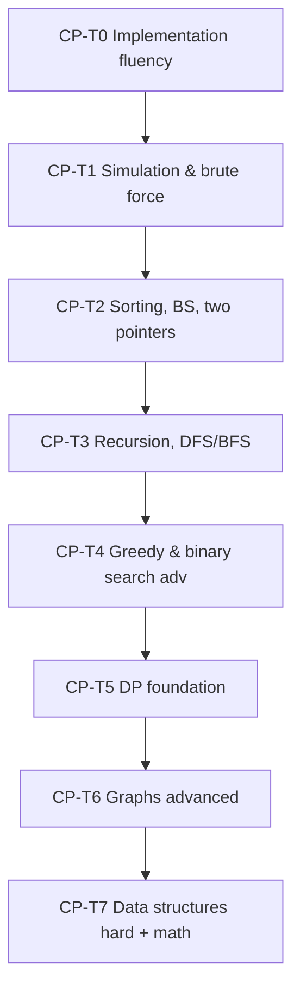

# Competitive Programming Roadmap

> **Goal:** Train algorithmic speed, proof discipline, and implementation fluency under time pressure — supporting interviews and examination performance.

**Parallel track:** Start CP-T0 after **SEC-12** (complexity in hand); run 3 hrs/week minimum throughout program.

---

## CP vs Curriculum

| CP teaches | Curriculum teaches |
|------------|-------------------|
| Fast recognition | Deep implementation |
| Contest constraints | Production engineering |
| Single-file solutions | Multi-module systems |

Both are required for graduation (GR-P).

---

## Tier Overview



---

## CP-T0 — Implementation Fluency

| Field | Value |
|-------|-------|
| **Prerequisites** | SEC-12 (DSA-01), SEC-07 (CPP-03) |
| **Hours** | 20–30 |
| **Solve target** | 15 problems |
| **Difficulty** | Div 3 A/B equivalent |

### Topics
- Fast I/O
- Loops, arrays, strings
- Basic STL (`vector`, `map`, `set`)

### Gate exam
5 problems / 2 hours — all must compile and pass sample tests.

### Platforms
- [CSES Introductory](https://cses.fi/problemset/)
- [Codeforces Div 3](https://codeforces.com/)

---

## CP-T1 — Simulation & Brute Force

| Field | Value |
|-------|-------|
| **Prerequisites** | CP-T0 |
| **Hours** | 30–40 |
| **Solve target** | 25 problems |

### Topics
- Simulation
- Complete search (small N)
- Ad-hoc implementation

### Gate
Virtual Div 3 — solve 3/5 within 2 hours.

---

## CP-T2 — Sorting, Binary Search, Two Pointers

| Field | Value |
|-------|-------|
| **Prerequisites** | CP-T1, ALG-01, ALG-02 |
| **Hours** | 40–60 |
| **Solve target** | 30 problems |

### Topics
- Custom comparators
- Lower/upper bound
- Two pointers on sorted arrays
- Prefix sums

### Representative problems
| Platform | ID |
|----------|-----|
| CSES | Sorting and Searching section |
| LeetCode | 33, 34, 167, 209 |
| Codeforces | Binary search tags |

### Gate
5 binary-search problems / 2.5 hours — 4/5 correct.

---

## CP-T3 — Recursion, DFS, BFS

| Field | Value |
|-------|-------|
| **Prerequisites** | CP-T2, DSA-09, ALG-06 |
| **Hours** | 50–70 |
| **Solve target** | 35 problems |

### Topics
- Tree DFS
- Graph BFS/DFS
- Flood fill
- Backtracking intro

### Gate
Virtual contest — top 60% in Div 3.

**Milestone link:** M7

---

## CP-T4 — Greedy & Advanced Binary Search

| Field | Value |
|-------|-------|
| **Prerequisites** | CP-T3, ALG-04 |
| **Hours** | 40–60 |
| **Solve target** | 25 problems |

### Topics
- Exchange arguments
- Greedy proofs (informal)
- Binary search on answer

### Gate
3 greedy + 2 BS-on-answer / 3 hours.

---

## CP-T5 — Dynamic Programming Foundation

| Field | Value |
|-------|-------|
| **Prerequisites** | CP-T4, ALG-05 |
| **Hours** | 60–80 |
| **Solve target** | 40 problems |

### Topics
- 1D DP
- 2D DP
- Knapsack variants
- LIS

### Gate
Virtual Div 2 — solve 2 problems.

**Graduation minimum tier**

---

## CP-T6 — Graphs Advanced

| Field | Value |
|-------|-------|
| **Prerequisites** | CP-T5, ALG-07, ALG-08 |
| **Hours** | 60–80 |
| **Solve target** | 35 problems |

### Topics
- Dijkstra
- Bellman-Ford
- MST (Kruskal, Prim)
- Topological sort

---

## CP-T7 — Hard Data Structures & Math

| Field | Value |
|-------|-------|
| **Prerequisites** | CP-T6, DSA-07, DSA-10 |
| **Hours** | 80–120 |
| **Solve target** | 30 problems |

### Topics
- Segment trees
- Fenwick trees
- DSU with path compression
- Modular arithmetic
- Combinatorics basics

**Honors distinction**

---

## Problem Logging

Log every solve in `09_Competitive_Programming/solve_log.md`:

```
| Date | Platform | Problem | Tier | Time | Upsolve? | Technique tags |
```

---

## Weekly Training Plan

| Day | Activity | Hours |
|-----|----------|-------|
| 1 | 2 new problems (study mode) | 1.5 |
| 2 | 1 upsolve + write complexity proof | 1 |
| 3 | Virtual contest or 3 timed problems | 1.5 |

---

## Topic → CP Problem Mapping (curriculum integration)

| Curriculum Topic | CP reinforcement |
|------------------|------------------|
| DSA-05 Hash tables | CF hashing problems |
| DSA-06 BST | LC 98, 230 |
| ALG-05 DP | CSES DP section |
| ALG-07 Shortest paths | CSES Graph section |
| ARCH-06 Events | Simulation queues |

---

## Interview Integration

CP skills map to:

| Interview round | CP skill |
|-----------------|----------|
| Phone screen | T2–T3 |
| Onsite algorithm | T4–T5 |
| Speed coding | T0–T1 |

Full banks in `17_Interview_Preparation/` (populated as topics complete).

---

## Common Mistakes (proactive)

1. Coding before thinking — write invariant first
2. Ignoring edge cases (N=0, N=1)
3. Wrong complexity — TLE acceptance
4. `int` overflow — use `long long`
5. Confusing CP patterns with production architecture

---

## Graduation Checklist (GR-P)

- [ ] 200 logged solves
- [ ] CP-T5 gate passed
- [ ] Virtual Div 2 top 50%
- [ ] Tags: DP ≥30, graphs ≥30, greedy ≥20

---

*CP roadmap version: 1.0*
