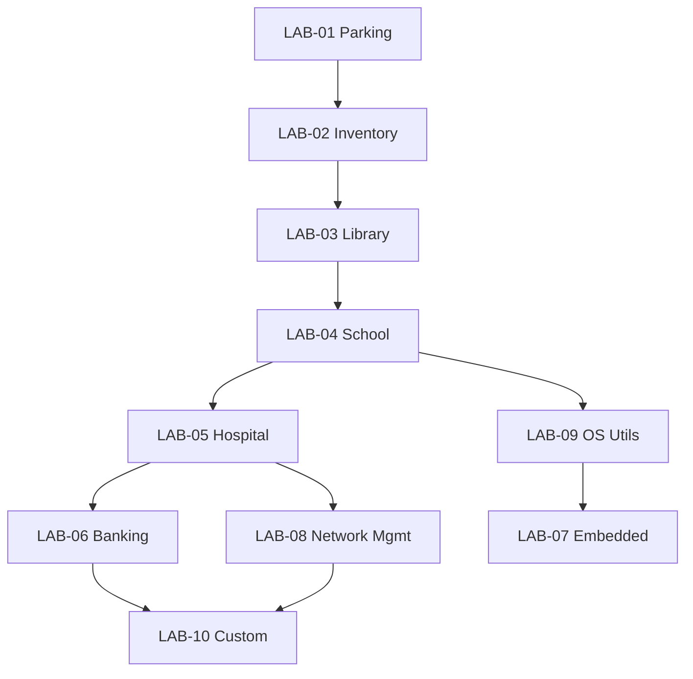

# Project Laboratory Roadmap

> Laboratories apply **universal curriculum** to **domain systems**.  
> A laboratory is **mastered** only when rebuild + oral gates pass — not when code first compiles.

---

## Laboratory Philosophy

| Principle | Meaning |
|-----------|---------|
| Domain diversity | Patterns transfer across parking, banking, hospitals |
| Curriculum first | Labs unlock by topic mastery, not by enthusiasm |
| SPSystem = one case | LAB-01 reference implementation; not a substitute for foundations |
| Progressive complexity | Each lab adds one major systems concern |
| Offline-capable | Every lab must be buildable with compiler + standard library (+ SQLite from LAB-04) |

---

## Laboratory Catalog



---

## LAB-01 — Parking Management System

| Field | Detail |
|-------|--------|
| **Domain** | Slot allocation, entry/exit, tariffs, revenue |
| **Hard prerequisites** | **Merge gate** (SEC-01–12, FE-A1, CST-01/03/05, FE-B1) + CPP-05, DSA-02–05, OOP-01–04, PAT-06, FS-02, DBG-02 |
| **Hours** | 40–60 (+ 8–12 SPSystem case study optional) |
| **Major concepts** | Facade, hash map, secondary index, file persistence |
| **SPSystem role** | Case study in `case_studies/SPSystem.md` — analyze after prerequisites |
| **Build** | Console C++17, text file persistence |
| **Mastery gate** | Rebuild in 6 hours without reference; oral: "add reservation system" |
| **Extensions** | Multi-zone, penalties, VIP slots |

### Core entities
`ParkingSlot`, `Vehicle`, `Tariff`, `ParkingRecord`, managers + facade.

---

## LAB-02 — Inventory Management System

| Field | Detail |
|-------|--------|
| **Domain** | SKUs, warehouses, stock in/out, reorder alerts |
| **Prerequisites** | LAB-01 mastered; DSA-14; FS-03 |
| **Hours** | 50–70 |
| **New concern** | Multi-entity transactions, quantity invariants |
| **Structures** | Hash map (SKU), tree (category), heap (reorder priority) |
| **Mastery gate** | Rebuild in 8 hours; oral: "merge two warehouses" |

---

## LAB-03 — Library Management System

| Field | Detail |
|-------|--------|
| **Domain** | Books, members, loans, fines, reservations |
| **Prerequisites** | LAB-02; ALG-01, ALG-02 |
| **Hours** | 50–70 |
| **New concern** | Search/sort at scale, due-date scheduling |
| **Mastery gate** | Rebuild in 8 hours; oral: "fine calculation policy change" |

---

## LAB-04 — School Management System

| Field | Detail |
|-------|--------|
| **Domain** | Students, courses, enrollment, grades, timetables |
| **Prerequisites** | LAB-03; ARCH-02; DB-01–02 |
| **Hours** | 60–80 |
| **New concern** | SQLite integration, relational schema, layered architecture |
| **Mastery gate** | Rebuild in 10 hours; oral: "add parent portal API" |

---

## LAB-05 — Hospital Management System

| Field | Detail |
|-------|--------|
| **Domain** | Patients, appointments, beds, staff shifts |
| **Prerequisites** | LAB-04; OS-03; NET-01–02 |
| **Hours** | 70–90 |
| **New concern** | Scheduling, concurrency, audit logs |
| **Mastery gate** | Rebuild in 12 hours; oral: "HIPAA-style access control" |

---

## LAB-06 — Banking System

| Field | Detail |
|-------|--------|
| **Domain** | Accounts, transfers, ledger, interest |
| **Prerequisites** | LAB-05; DB-04; NET-08 |
| **Hours** | 80–100 |
| **New concern** | ACID transactions, idempotency, security |
| **Mastery gate** | Rebuild in 12 hours; oral: "double-spend prevention" |

---

## LAB-07 — Embedded Sensor Monitor

| Field | Detail |
|-------|--------|
| **Domain** | Sensor readings, thresholds, alerts, constrained memory |
| **Prerequisites** | OS-01–05; FS-06; CPP-15 |
| **Hours** | 80–100 |
| **New concern** | Fixed buffers, no heap, interrupt-safe design |
| **Platform** | Hosted simulation acceptable; bonus: ARM Cortex-M |
| **Mastery gate** | Rebuild firmware module; oral: "power-loss recovery" |

---

## LAB-08 — Network Management System

| Field | Detail |
|-------|--------|
| **Domain** | Device inventory, SNMP-like polling, alerts, topology |
| **Prerequisites** | NET-01–07; OS-07 |
| **Hours** | 80–100 |
| **New concern** | Concurrent I/O, protocol parsing, monitoring |
| **Mastery gate** | Rebuild polling engine; oral: "scale to 10k devices" |

---

## LAB-09 — OS Utility Suite

| Field | Detail |
|-------|--------|
| **Domain** | Clone utilities: `cat`, `wc`, `grep`, `find`, mini-shell |
| **Prerequisites** | OS-01–09; CPP-05 |
| **Hours** | 60–80 |
| **New concern** | Syscalls, file descriptors, process creation |
| **Mastery gate** | Implement 5 utilities from spec; oral: "explain fork/exec" |

---

## LAB-10 — Custom Domain (Capstone Prep)

| Field | Detail |
|-------|--------|
| **Domain** | Student-proposed; instructor-approved |
| **Prerequisites** | 3+ labs mastered; ARCH-04 |
| **Hours** | 80–120 |
| **Deliverable** | Full spec → implementation → rebuild |

---

## SPSystem Case Study (not a lab shortcut)

**Location:** `14_Project_Laboratories/case_studies/SPSystem.md`

| Use | Do not use |
|-----|------------|
| Illustrate Facade after PAT-06 | Proof of CPP mastery |
| Illustrate hash map after DSA-05 | Proof of hash table understanding |
| Sequence diagram reading after ARCH-02 | Substitute for LAB-01 rebuild |
| Compare your rebuild to SPSystem design | Copy-paste for LAB-01 gate |

---

## Laboratory Progression Table

| Order | Lab | New skill introduced |
|-------|-----|---------------------|
| 1 | LAB-01 | Manager decomposition, file I/O |
| 2 | LAB-02 | Stock invariants, alerts |
| 3 | LAB-03 | Search, sorting, fines |
| 4 | LAB-04 | SQL, layered architecture |
| 5 | LAB-09 | Syscalls (can parallel with 4) |
| 6 | LAB-05 | Scheduling + networking intro |
| 7 | LAB-06 | Transactions + security |
| 8 | LAB-07 or LAB-08 | Embedded **or** network ops |
| 9 | LAB-10 | Integration |

---

## Per-Laboratory Folder Structure

```
14_Project_Laboratories/
├── LAB-01_Parking/
│   ├── specification.md
│   ├── design_template.md
│   ├── mastery_gate.md
│   └── case_studies/SPSystem.md
├── LAB-02_Inventory/
...
```

*Topic content generated on unlock.*

---

*Laboratory roadmap version: 1.0*
