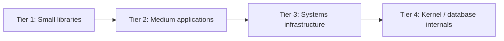

# Open Source Study Roadmap

> **Goal:** Learn to read professional codebases without tutorials — trace features, identify invariants, understand build systems.

---

## Study Philosophy

| Phase | Skill |
|-------|-------|
| Read | Navigate repo structure, build, find entry point |
| Trace | Follow one feature across modules |
| Critique | Identify tradeoffs and mistakes |
| Compare | Relate to your laboratory implementations |
| Contribute | Optional: one documentation fix or micro-PR |

---

## Prerequisites

| Requirement | Section |
|-------------|---------|
| Multi-file C++ builds | CPP-14 |
| OOP composition | OOP-03 |
| Basic debugging | DBG-02 |

**Unlock:** After FE-02 passed (read-only studies); full critique track after FE-04.

---

## Tier Structure

---

## Tier 1 — Small Libraries (FE-02+)

**Hours:** 8–12 each | **Count required:** 2

| # | Repository | Study focus | Curriculum link |
|---|------------|-------------|-----------------|
| 1.1 | [nlohmann/json](https://github.com/nlohmann/json) | Header-only vs compiled; API design | CPP-07, FS-02 |
| 1.2 | [fmtlib/fmt](https://github.com/fmtlib/fmt) | Type-safe formatting; CMake | CPP-08, CPP-14 |
| 1.3 | [catchorg/Catch2](https://github.com/catchorg/Catch2) | Test macros; TU organization | DBG-05 |

**Deliverable:** 3-page report — entry point, build, one feature trace.

---

## Tier 2 — Medium Applications (FE-04+)

**Hours:** 15–25 each | **Count required:** 2

| # | Repository | Study focus | Curriculum link |
|---|------------|-------------|-----------------|
| 2.1 | [sqlite/sqlite](https://github.com/sqlite/sqlite) | Amalgamation; B-tree; VDBE | DB-03, DB-06 |
| 2.2 | [redis/redis](https://github.com/redis/redis) | Event loop; in-memory structures | NET-06, DSA-05 |
| 2.3 | [citizenen/MicroServices](https://github.com/serge1/serf) or similar service | REST patterns | ARCH-05, NET-04 |
| 2.4 | [qbittorrent/qBittorrent](https://github.com/qbittorrent/qBittorrent) | Large C++ app structure | ARCH-04 |

**Deliverable:** Feature trace diagram + 5 ADRs written as if you maintained the project.

---

## Tier 3 — Systems Infrastructure (FE-07+)

**Hours:** 25–40 each | **Count required:** 1

| # | Repository | Study focus |
|---|------------|-------------|
| 3.1 | [torvalds/linux](https://github.com/torvalds/linux) (subset) | VFS, scheduler reading |
| 3.2 | [nginx/nginx](https://github.com/nginx/nginx) | Event-driven server |
| 3.3 | [facebook/rocksdb](https://github.com/facebook/rocksdb) | LSM tree persistence |
| 3.4 | [git/git](https://github.com/git/git) | Content-addressed storage |

**Deliverable:** Oral presentation — 20 min code walk without slides.

---

## Tier 4 — Honors (optional)

| Repository | Focus |
|------------|-------|
| PostgreSQL source | Query planner |
| LLVM | Compiler pipeline |
| Chromium (subset) | Multi-process architecture |

---

## SPSystem as Comparative Study

After LAB-01 rebuild attempted:

| Activity | Purpose |
|----------|---------|
| Compare your `SlotManager` to redis dict | Hash table design |
| Compare persistence to SQLite pager | Durability tradeoffs |
| Compare facade to nginx module pattern | Composition |

**SPSystem is not OSS** — it is a **student laboratory reference** for comparison exercises only.

---

## Study Method (mandatory steps)

1. **Build** — reproduce build from README
2. **Map** — directory tree with annotations
3. **Entry** — find `main` or library public API
4. **Trace** — pick one user-visible feature; follow 5+ files
5. **Test** — run existing tests; add one observation
6. **Report** — use template in `15_Open_Source_Studies/report_template.md`

---

## Report Template Sections

1. Repository metadata (license, language, size)
2. Build graph
3. Architectural style
4. Feature trace (diagram)
5. Three design strengths
6. Three design weaknesses
7. Connection to curriculum topics
8. Connection to laboratory work
9. One question for maintainers

---

## Graduation Requirement

**5 reports** minimum: 2× Tier 1, 2× Tier 2, 1× Tier 3.

Logged in `PROGRESS_TRACKER.md`.

---

## Scheduling

| Year | Target |
|------|--------|
| 1 | 1 Tier-1 (fmt or Catch2) |
| 2 | 1 Tier-1 + 1 Tier-2 (SQLite) |
| 3 | 1 Tier-2 + 1 Tier-3 |
| 4 | Honors optional |

**Parallel:** 2–4 hours/week alongside labs.

---

*OSS roadmap version: 1.0*
