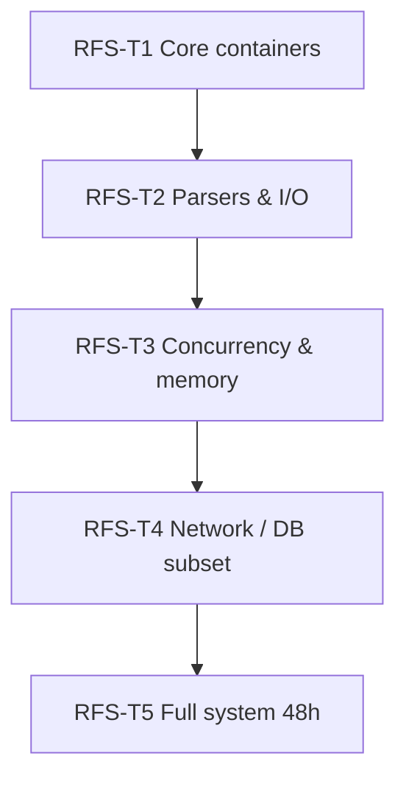

# Rebuild From Scratch Roadmap

> **Goal:** Prove concepts live in long-term memory — not in project folders or IDE autocomplete.

**Exam conditions:** No internet, no prior code, no AI. Allowed: blank editor, compiler, language standard reference (offline).

---

## Philosophy

| Memorization | Rebuild mastery |
|--------------|-----------------|
| Recite API | Implement API |
| Recognize pattern | Derive pattern from constraints |
| Copy from old project | Type from mental model |

Every curriculum section assigns **RFS micro-challenges**. This roadmap defines **tier capstones**.

---

## Tier Structure



---

## RFS-T1 — Core Containers

| Field | Value |
|-------|-------|
| **Prerequisites** | FE-02, FE-03 |
| **Time limit** | 4 hours each |
| **Challenges** | |

### RFS-T1a — `DynamicArray<T>`
- push_back, pop_back, operator[], size, capacity
- Amortized O(1) push
- Iterator (optional advanced)

### RFS-T1b — `HashMap<K,V>` (chaining)
- insert, find, erase
- Custom hash for strings
- Load factor handling

### RFS-T1c — `BinarySearchTree<K,V>`
- insert, find, remove (min case)
- In-order traversal

### Pass criteria
All three compile, basic tests pass, oral complexity defense.

**Unlocks:** RFS-T2, LAB rebuild eligibility boost

---

## RFS-T2 — Parsers & Serialization

| Field | Value |
|-------|-------|
| **Prerequisites** | RFS-T1, FE-11 |
| **Time limit** | 6 hours each |

### RFS-T2a — Line-oriented config parser
`key=value` files, comments, sections

### RFS-T2b — Minimal JSON subset
Objects, arrays, strings, numbers — no unicode escapes required

### RFS-T2c — CSV reader/writer
Typed columns, header row, escape rules

### Pass
Round-trip test; corruption detection for one format.

---

## RFS-T3 — Concurrency & Memory

| Field | Value |
|-------|-------|
| **Prerequisites** | FE-07, RFS-T2 |
| **Time limit** | 8 hours (choose one) |

### Option A — Thread pool
- Task queue, N workers, graceful shutdown
- No data races (instructor verifies)

### Option B — Arena allocator
- allocate, reset arena
- Used by parser from T2

### Option C — Producer-consumer
- Bounded buffer, mutex + condition variable

---

## RFS-T4 — Network or Database Subset

| Field | Value |
|-------|-------|
| **Prerequisites** | FE-12 or FE-13, RFS-T3 |
| **Time limit** | 10 hours (choose one) |

### Option A — HTTP/1.1 GET server
- Parse request line, serve static files, 404 handling

### Option B — Mini key-value store
- put/get/delete on disk with append-only log
- Crash recovery (replay log)

### Option C — SQLite wrapper
- Open DB, execute prepared SELECT/INSERT

---

## RFS-T5 — Full Management System (Graduation)

| Field | Value |
|-------|-------|
| **Prerequisites** | GR-C prerequisites; all RFS-T1–T4 |
| **Time limit** | 48 hours |
| **Equivalent** | CAP-05 |

See `GRADUATION_REQUIREMENTS.md`.

---

## Per-Section Micro-Challenges

| Section | Challenge | When |
|---------|-----------|------|
| 01 | Draw computation model; write spec from prompt | After F-07 |
| 02 | Build pipeline diagram; explain linker error | After CPP-01 |
| 03 | Implement linked list on paper → code | After DSA-03 |
| 04 | Class diagram → code without IDE | After OOP-04 |
| 05 | Name patterns in 20-line monolith | After PAT-06 |
| 06 | C4 L2 diagram from memory | After ARCH-04 |
| 07 | fork/exec sketch | After OS-09 |
| 08 | Write Dijkstra without looking | After ALG-07 |
| 11 | Design file format | After FS-02 |
| 12 | Socket server sketch | After NET-02 |
| 13 | 3NF schema from ER description | After DB-05 |

---

## SPSystem Rebuild Challenge (LAB-01 gate)

**Not before:** CPP-01–07, DSA-01–05, OOP-01–04 mastered.

| Field | Value |
|-------|-------|
| **Time** | 6 hours |
| **Allowed** | Problem statement card, blank project |
| **Not allowed** | SPSystem source, internet |
| **Must include** | SlotManager, VehicleManager, TariffManager, HistoryManager, file persistence |
| **Pass** | Entry/exit/revenue work; oral defense |

Studying SPSystem beforehand is **preparation**, not **evidence**.

---

## Grading Rubric

| Dimension | Weight |
|-----------|--------|
| Compiles & runs | 25% |
| Correctness (core cases) | 30% |
| Design clarity | 20% |
| Complexity awareness | 15% |
| Oral defense | 10% |

---

## Remediation

Fail → 48-hour cooldown → assigned reading + 3 micro-drills → retry once per tier.

---

## Progress Log

Record in `MASTERY_LOG.md`:

```
| Date | Challenge ID | Time taken | Pass/Fail | Notes |
```

---

*RFS roadmap version: 1.0*
