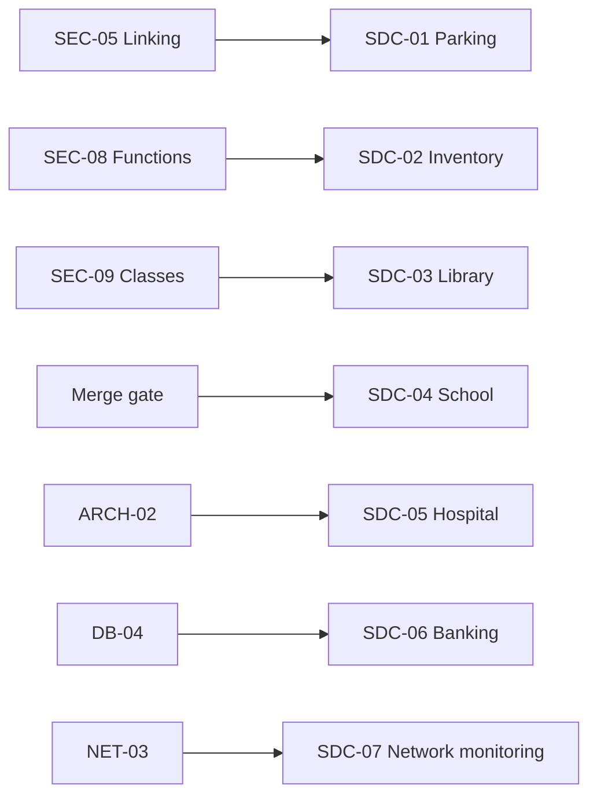

# System Design Challenges Roadmap

> Reinforces SEC track. Does **not** gate SEC progression (except where noted as merge enrichment).

## Challenge Catalog

| ID | System | SEC reinforcement | Unlock after | Lab parallel |
|----|--------|-------------------|--------------|--------------|
| SDC-01 | Parking management | SEC-05 linking, SEC-11 STL | **SEC-05** | LAB-01 |
| SDC-02 | Inventory management | SEC-11, SEC-12 complexity | SEC-08 | LAB-02 |
| SDC-03 | Library management | SEC-09 classes, SEC-12 | SEC-09 | LAB-03 |
| SDC-04 | School management | SEC-10 lifetimes, merge gate | **Merge** | LAB-04 |
| SDC-05 | Hospital management | Post-merge architecture | ARCH-02 | LAB-05 |
| SDC-06 | Banking system | Transactions, security | DB-04 | LAB-06 |
| SDC-07 | Network monitoring | Sockets, concurrency | NET-03 | LAB-08 |

**SPSystem:** Reference for comparing **your** SDC-01 design after submission — not a template to copy.

---

## Per-Challenge Deliverables

Each challenge folder contains:

1. Problem statement (requirements card)
2. Constraints card (scale, offline, no external DB unless stated)
3. Design template (modules, diagrams, DS choices)
4. Mastery rubric (instructor grading)
5. Sample solution sketch (unlocked **after** your design submitted)
6. SEC concept map (which SEC topics this challenge exercises)

## Mastery Gate (per challenge)

| # | Requirement |
|---|-------------|
| 1 | Component diagram from memory |
| 2 | 3+ invariants stated formally |
| 3 | DS choice per major operation with Big-O |
| 4 | Entry + exit sequence diagram |
| 5 | 15-min oral defense + one change request |

**Pass:** ≥4/5 rubric dimensions at ≥80%.

---

## Progressive Unlock Graph

---

## Time Budget

| Challenge | Design hours | Oral |
|-----------|--------------|------|
| SDC-01 | 4–6 | 15 min |
| SDC-02 | 5–7 | 15 min |
| SDC-03 | 5–7 | 15 min |
| SDC-04 | 6–8 | 20 min |
| SDC-05+ | 8–12 | 20 min |

Run **parallel** to SEC: 1–2 hrs/week when unlocked.

---

## Graduation Link

- **GR-I:** 4+ SDC challenges passed counts toward interview readiness
- **CAP-01:** Requires SDC-01, SDC-02, SDC-04 passed

---

*SDC roadmap v1.0 — frozen with curriculum v2.0*
