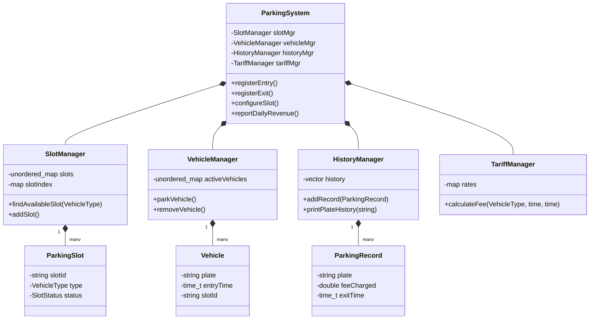
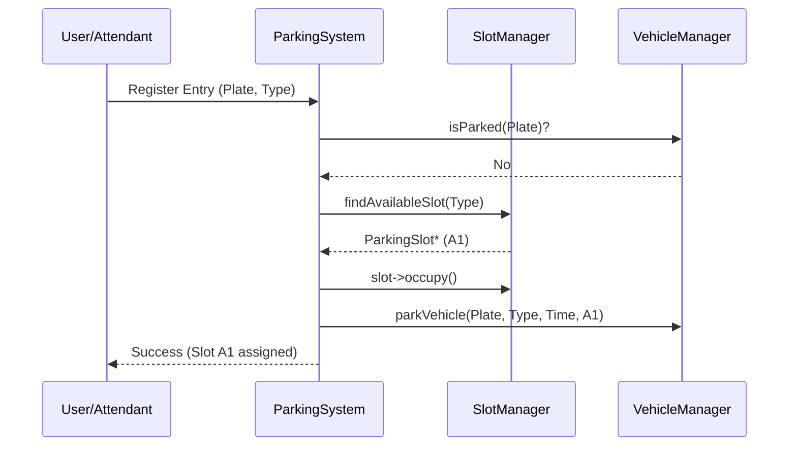
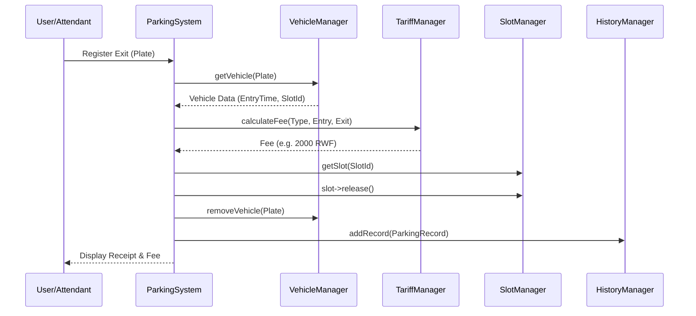

# Kigali Smart Parking - Architecture Diagrams

## 1. Core Components and Relationships (Class Diagram)
This diagram illustrates the object-oriented structure and the relationships between the facade, the managers, and the data entities.

## 2. Vehicle Entry Data Flow
The sequence of interactions when a vehicle arrives at the parking facility.

## 3. Vehicle Exit and Payment Data Flow
The sequence of interactions when a vehicle leaves and the fee is processed.

